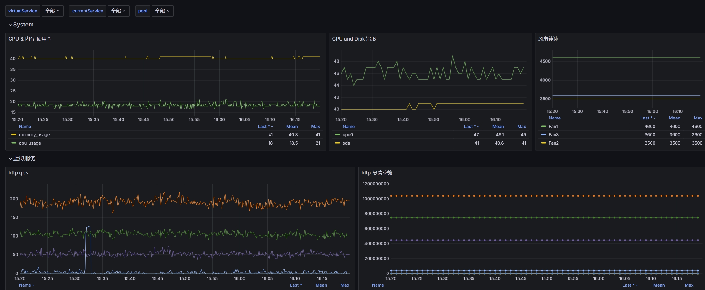

## AD Service Prometheus Exporter
1. 深信服 AD 服务 prometheus exporter 
2. 根据配置文件，GET请求AD服务的API
3. 解析API返回数据，并转换为Prometheus格式数据
4. grafana dashboard模板 (grafana.json)

```bash
# 存在以下类似数据都会被解析

# 例1
"temperature": {
"model": "INSTANT",
"value": 51.0,
"timestamp": 1718768235,
"unit": "DEGREE-CENTGRADE"
}

# 例2
"fan": [
{
    "name": "Fan1",
    "speed": {
    "model": "INSTANT",
    "value": 4600,
    "timestamp": 1718768235,
    "unit": "REVOLUTION-PER-MINUTE"
    }
}
]

```



## Run
```bash
git clone https://github.com/mingjiezxc/ad-exporter.git
cd ad-exporter
chmod +x ad-exporter
docker-compose up -d
```